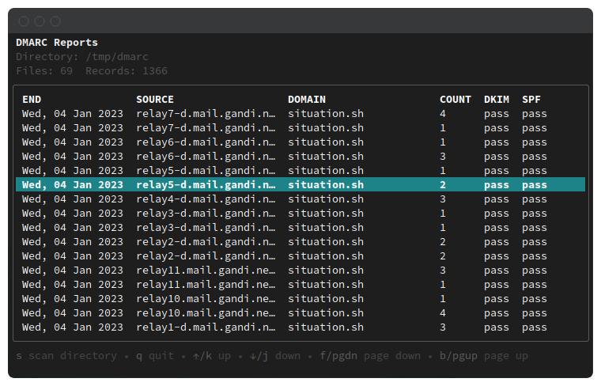
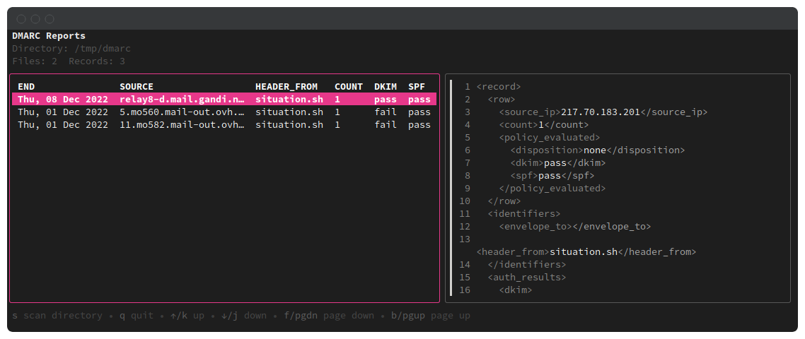

# tmarc

TUI for DMARC reports





:arrow_right: If you are drowning in DMARC reports and don't know how to summarize it all.

## Installation

You can directly download and build with `go`.

```shell
go install github.com/situation-sh/tmarc@latest
```

Otherwise you can clone/make (you may need to install [xgen](https://github.com/xuri/xgen)).

```shell
git clone https://github.com/situation-sh/tmarc
cd tmarc
make build # binary located in build/
```

## Get started

You can run the program without any options.

```shell
tmarc
```

By default it scans the current directory to find DMARC reports (in plain xml or within archives).
You can change it with the `-d` flag.

```shell
tmarc -d /path/to/dir/where/all/the/reports/are/stored
```

This is particularly useful, if you have setup an email filter that sends report to this folder.

For the fancyness, you can also change the main color with the `-t` flag.
